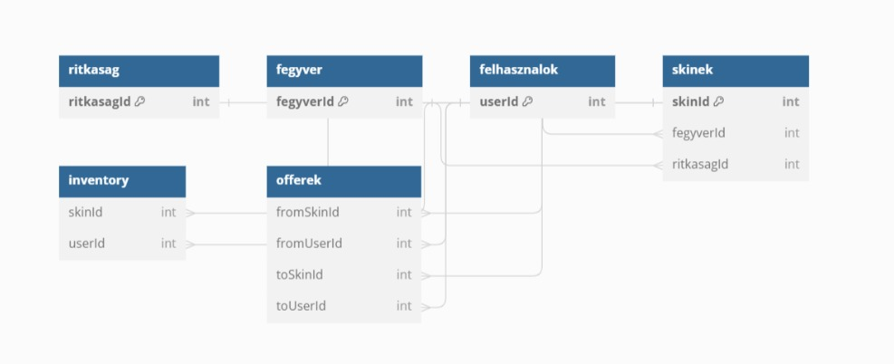

## 1. Bevezetés

# 1.1. Cél

Ezen dokumentum célja, hogy ismertesse a SkinCsere portál készítéséhez szükséges funkcionális követelményeket. 
A specifikáció alapján a fejlesztőcsapat egyértelműen értelmezheti és megvalósíthatja a rendszer funkcióit.

# 1.2. Hatály

A dokumentum a SkinCsere Portál webalkalmazás fejlesztési projektjére vonatkozik.

## 2. Rendszerleírás

# 2.1. Rendszer célja

Lehetőséget nyújt a felhasználóknak, hogy regisztráljanak, véletlenszerű skint kapjanak, majd skineket cseréljenek egymással.

# 2.2. Felhasználói esetek (Use-case)

Felhasználó regisztrálása/bejelentkezése.
Véletlenszerű skin kiosztása a felhasználónak.
Skin-ek listázása.
Skin csere ajánlat létrehozása.
Csere ajánlatok fogadása/elutasítása.
## 3. Követelmények

# 3.1. Funkcionális követelmények

Regisztráció/Bejelentkezés: A felhasználók létrehozhatnak egy fiókot, és bejelentkezhetnek a rendszerbe.
Véletlenszerű skin kiosztás: Minden sikeres regisztrációt követően a felhasználó egy véletlenszerű skint kap.
Skin listázás: A felhasználók megtekinthetik saját és mások skineit.
Csere ajánlat: A felhasználók ajánlatot tehetnek egy másik felhasználó skinjére és fogadhatnak/utasíthatnak el ajánlatokat.
# 3.2. Nem-funkcionális követelmények

Biztonság: Az adatok biztonságosan vannak tárolva, a tranzakciók átláthatóak.
Reszponzivitás: A webalkalmazás minden eszközön (desktop, tablet, mobil) jól használható.
## 4. Rendszer működése

# 4.1. Regiszráció/Bejelentkezés

Felhasználó regisztráció gombra kattint átirányítjuk egy regisztrációs ablakba.
Regisztrálni adatai kitöltésével lehetséges az alábbi sorrendben; felhasználónév, email, jelszó
A regisztráció után a bejelentkezés fülre kattintva átirányításra kerül a bejelentkezés ablakba.
Bejelentkezéshez a regisztrációkor megadott felhasználónév, és jelszó páros megadása szükséges.
Bejelentkezés után újra a főodalon találja magát a felhasználó.
Sikertelen bejelentkezés esetén a rendszer hibaüzenetet jelenít meg.

# 4.2 Oldalon található gombok
Inventory,Allskins, Offers, Logout gombok találhatók.
Az inventory  gombbal a saját inventory-ját mutató oldalra irányítjuk át.
Allskins gombbal átirányítjuk a felhasználót egy oldalra amin láthaja az összes oldalon fenn lévő skint.
Offers gombbal átirányítjuk a felhasználót egy oldalra amin látja az offereit. Itt van három gomb az egyikkel elbírja fogadni a másikkal pedig elutasítani az offert a harmadikkal pedig új offert bír létrehozni.
Logout gombbal pedig kijelentkezhet a felhasználó az oldalról.

Ajánlat elutasítása esetén a rendszer értesítést küld a felhasználónak.
## 5. Adatmodell

# 5.1. Felhasználók

userId: INT (Egyedi azonosító)
username: VARCHAR(255) (Felhasználónév)
passwd: VARCHAR(255) (Jelszó)
email: VARCHAR(255) (E-mail cím)
# 5.2. Skinek

skinId: INT (Skin egyedi azonosítója)
kep: VARCHAR(255) (Skin képének útvonala/elérhetősége)
nev: VARCHAR(255) (Skin neve)
ritkaságId: INT (Hivatkozás a ritkaság táblára)
érték: INT (Skin értéke)
fegyverId: INT (Hivatkozás a fegyver táblára)
# 5.3. Fegyver

fegyverId: INT (Egyedi azonosító)
fegyverNev: VARCHAR(255) (Fegyverek nevei, mint például "AK-47", "M4A1-S", stb.)
# 5.4. Ritkaság

ritkasagId: INT (Egyedi azonosító)
ritkasagNev: VARCHAR(255) (Ritkaságok, mint "kék", "lila", "rózsaszín", stb.)
# 5.5. Inventory

skinId: INT (Hivatkozás a skinek táblára)
userId: INT (Hivatkozás a felhasználók táblára)
# 5.6. Offers

fromUserId: INT (Ajánlatot tevő felhasználó ID-ja)
fromskinId: INT (Ajánlatot tevő felhasználó skinjének ID-ja)
toUserId: INT (Ajánlatot fogadó felhasználó ID-ja)
toskinId: INT (Ajánlatot fogadó felhasználó skinjének ID-ja)
elfogadva: BOOL (Megjelöli, hogy az ajánlatot elfogadták-e)

## 6. Megvalósítás

A webalkalmazás React-Node.js technológiával, MYSQL adatbázissal kerül fejlesztésre.
# 7. Fogalomtár

## Counter-Strike: 
- Első nézetű többjátékos online lövöldözős játék, amelyet a Valve és a Hidden Path Entertainment fejlesztett és adott ki 2012-ben. A játék két csapat, a terroristák és a counter-terroristák közötti összecsapásra koncentrál, különböző küldetéseken keresztül.
## Skin:
- A Counter-Strike: Global Offensive játékon belüli fegyverek és egyéb tárgyak testreszabását lehetővé tevő grafikai bevonatok. Ezek a skinek befolyásolják a fegyverek megjelenését, de nem adnak semmilyen előnyt a játékban. A játékosok megvásárolhatják, elcserélhetik vagy eladhatják ezeket a skineket a Steam Közösségi Piacon vagy más platformokon.
## Offer:
-ajánlat
## Trade:
-csere
