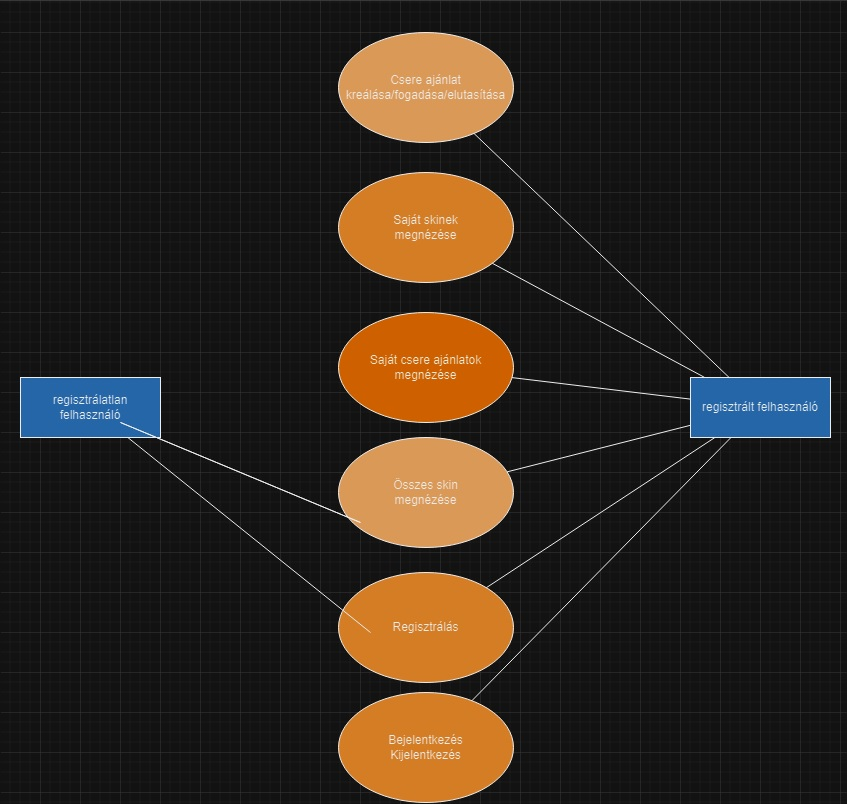

# 1. A rendszer célja
A rendszerterv célja, hogy meghatározza a SkinCsere Portál műszaki és architekturális követelményeit, 
és hogy irányt adjon a fejlesztőcsapatnak a projekt megvalósítása során.

## Vágyálom rendszer
Az ideális rendszerben a felhasználók gyorsan és egyszerűen regisztrálhatnak, majd azonnal belemerülhetnek az alkalmazás élményébe. A kezelőfelület intenzív, azonban nem zavaróan zsúfolt, így a felhasználó könnyedén megtalálja a számára lényeges funkciókat.

# 2. Projektterv
- **Developer Team**: Szabó Márk, Bartus János, Pál József, Erdész Réka

| Funkció                     | Feladat                                   |
| ----------------------------| ------------------------------------------|
| Köv. spec                   | A megrendelő dokumentációja               |       
| Funk. spec                  | A fejlesztő csapat dokumentációja         |       
| Rendszerterv                | A rendszer átfogó dokumentációja          |      
| Adattárolás                 | Adatbázis megvalósítása                   |      
| Regisztrációs felület       | Regisztráció frontend/backend             |      
| Bejelentkezési felület      | Bejelentkezés frontend/backend            |       
| Főoldal                     |                                           |
| Design                      | css/javascript                            |    
# 3. Üzleti feladatok modellje

# 4. Követelmények

## Funkcionális követelmények:

Regisztráció/Bejelentkezés: A felhasználók létrehozhatnak egy fiókot, és bejelentkezhetnek a rendszerbe.
Véletlenszerű skin kiosztás: Minden sikeres regisztrációt követően a felhasználó egy véletlenszerű skint kap.
Skin listázás: A felhasználók megtekinthetik saját és mások skineit.
Csere ajánlat: A felhasználók ajánlatot tehetnek egy másik felhasználó skinjére és fogadhatnak/utasíthatnak el ajánlatokat.

# 5. Funkcionális terv 
## Rendszerszereplők:
- **Felhasználó**
- **Admin**

## Rendszerhasználati esetek és lefutásaik:

**Felhasználó**:
- Csereajánlatot küldeni
- Csereajánlatot elfogadni
- Csereajánlatot elutasítani
- Saját inventory megnézése
- Összes skin megnézése

**Admin**:
- Skinek feltöltése

## Menü-hierarchiák:
- **FŐMENÜ**
    - Bejelentkezés
    - Regisztráció
- **BEJELENTKEZÉS**
    - Regisztráció
    - Főmenü
- **REGISZTRÁCIÓ**
    - Bejelentkezés
    - Főmenü
- **INVENTORY**
    - Nincs gomb
- **ALLSKINS**
    - Nincs gomb
- **OFFERS**
    - Elfogadás
    - Elutasítás
    - Csere kezdeményezés

## Menükhöz tartozó specifikációk:
| Modul | ID | Név | v. | Kifejtés |
|---|---|---|---|---|
| Főmenü | K1 | Főmenü | 1.0 | Itt található a bejeltkezés és a regisztráció |
| Bejelentkezés | K1 | Bejelentkezés | 1.0 | A bejelentkezés gombbal az oldalra lehet bejelentkezni |
| Inventory | K1 | Inventory | 1.0 | Az Inventory gombbal meg lehet nézni a saját inventorydban lévő skineket |
| Allskins | K1 | Allskins | 1.0 | Az allskins gombbal meglehet nézni az oldal lévő összes skint|
| Offers | K1 | Offers | 1.0 | Az offers gombbal meglehet nézni milyen offereid vannak és itt lehet offereket elfogadni/elutasítani/kreálni |

# 6. Fizikai Környezet

A teszt webes környezetben és minden böngészőben reszponzívnak készül el.
Nincsenek megvásárolt komponenseink.

# 7. Fejlesztői eszközök:

- Visual Studio Code
- XAMPP

# 8. Architekturális terv
A rendszer háromrétegű architektúrát követ:

- **Kliensréteg (Frontend):**
    - React alapú, a felhasználói interakciókért felelős.
- **Üzleti logika réteg (Backend):**
    - Node.js segítségével készül, és kezeli a logikai műveleteket.
- **Adatrétég:** 
    - MYSQL adatbázis, ahol az adatok tárolódnak.

# 9. Adatbázis terv

# 10. Használt technológiák

- Trello - projekt szervezése, rendezése
- Discord - verbális kommunikáció
- Git, GitHub - Alkalmazás verzióinak követése
- Rajzolóprogramok az ábrákhoz(draw.io)
- Kódszerkesztők (Visual Studio Code)
- Prototype - mockup, képernyő tervek